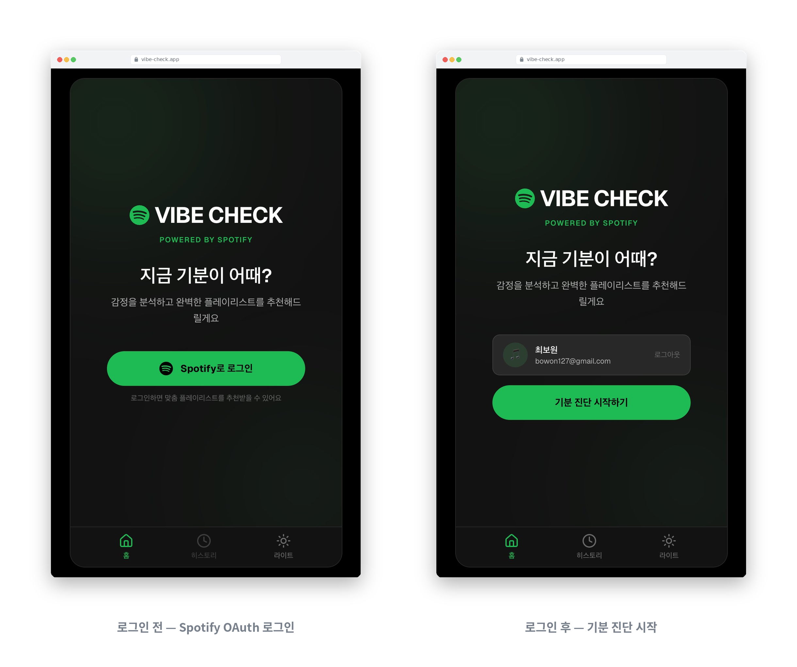
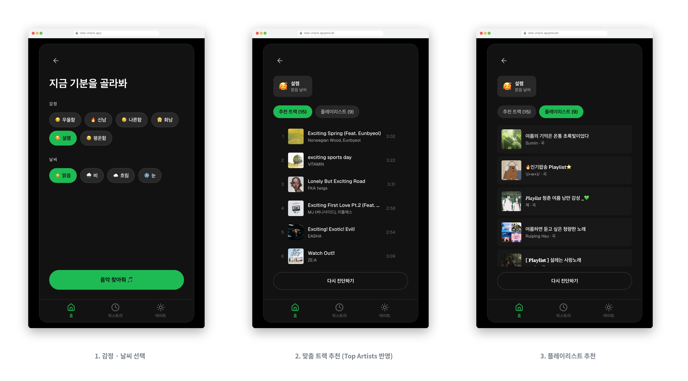
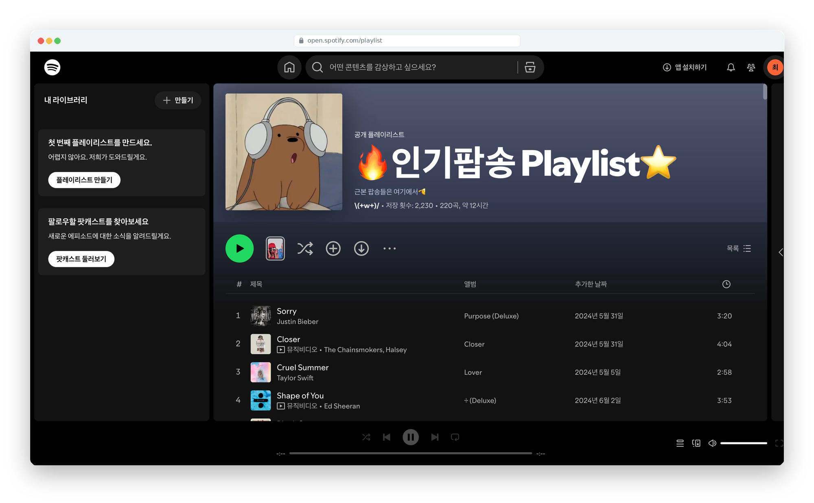
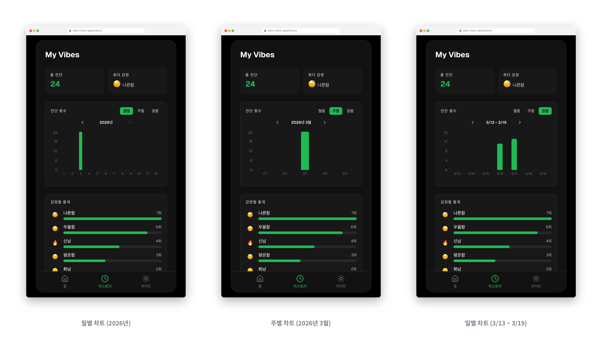

# 🎧 Vibe Check
> Spotify Web API를 활용한 감정 + 날씨 기반 맞춤 플레이리스트 추천 웹앱

<!--  -->

<p align="center">
  
</p>

<br>

# 목차

[1-프로젝트 소개](#1-프로젝트-소개)

- [1-1 개요](#1-1-개요)
- [1-2 주요목표](#1-2-주요목표)
- [1-3 개발환경](#1-3-개발환경)
- [1-4 구동방법](#1-4-구동방법)

[2-Architecture](#2-architecture)
- [2-1 구조도](#2-1-구조도)
- [2-2 파일 디렉토리](#2-2-파일-디렉토리)

[3-프로젝트 특징](#3-프로젝트-특징)

[4-프로젝트 세부과정](#4-프로젝트-세부과정)

[5-업데이트 및 리팩토링 사항](#5-업데이트-및-리팩토링-사항)

---

## 1-프로젝트 소개

### 1-1 개요
> 현재 기분과 날씨를 고르면 Spotify에서 어울리는 트랙과 플레이리스트를 찾아주는 웹앱
- **개발기간** : 2026.02.14 – 02.24
- **참여인원** : 1인 (개인 프로젝트)
- **주요특징**
  - 6가지 감정 × 4가지 날씨 = 24가지 조합으로 **트랙 / 플레이리스트** 두 탭의 추천 결과 제공
  - Spotify OAuth 2.0(Authorization Code Flow) 로그인 + **Refresh Token 자동 갱신**
  - **Top Artists** 기반 개인화 추천 (로그인 사용자 최근 청취 아티스트 반영)
  - **Supabase**를 통한 감정 진단 히스토리 영속화 + 월/주/일 단위 차트 시각화
  - Spotify 디자인 언어를 차용한 다크/라이트 테마, 모바일 프레임 기반 반응형 UI

### 1-2 주요목표
- OAuth 2.0 Authorization Code Flow의 동작 메커니즘 이해 및 구현
- Spotify Web API(Search / Top Artists / User Profile) 연동과 키워드 매핑 추천 로직 설계
- Next.js App Router 기반 풀스택 구조 경험 (Client Component + Route Handler)
- HttpOnly Cookie + Refresh Token 자동 갱신을 통한 안전한 세션 관리
- Supabase(Postgres)를 외부 DB로 연결한 서버리스 백엔드 구성 경험

### 1-3 개발환경
- **Framework / Runtime** : Next.js 16 (App Router), React 19, TypeScript 5
- **Styling** : Tailwind CSS 4, PostCSS, CSS Variables(다크/라이트 테마)
- **Auth** : Spotify OAuth 2.0 (Authorization Code Flow), HttpOnly Cookie, CSRF State 검증
- **External API** : Spotify Web API (Search, Top Artists, User Profile)
- **Database** : Supabase (PostgreSQL) - 감정 진단 히스토리 저장

- **주요 라이브러리**

  라이브러리  | 버전  | 용도
  ----| ----- | -----
  @supabase/supabase-js | ^2.99.1 | Supabase Postgres 클라이언트
  lucide-react | ^0.575.0 | 아이콘 컴포넌트
  recharts | ^3.7.0 | 히스토리 차트 시각화 (BarChart)

### 1-4 구동방법

순서  | 내용  | 비고
----| ----- | -----
1 | `npm install` 로 패키지를 설치합니다 | -
2 | [Spotify Developer Dashboard](https://developer.spotify.com/)에서 앱을 생성합니다 | Spotify 계정 필요
3 | 앱 Settings의 Redirect URI에 `http://127.0.0.1:3000/api/auth/callback` 을 등록합니다 | -
4 | [Supabase](https://supabase.com/)에서 프로젝트를 생성하고 `mood_history` 테이블을 만듭니다 | 하단 스키마 참고
5 | 프로젝트 루트에 `.env.local` 파일을 만들고 환경 변수를 입력합니다 | -
6 | `npm run dev` 로 개발 서버를 실행합니다 | -
7 | 브라우저에서 `http://127.0.0.1:3000` 으로 접속합니다 | `localhost` 가 아닌 `127.0.0.1` 사용

**.env.local**
```env
# Spotify
SPOTIFY_CLIENT_ID=your_client_id
SPOTIFY_CLIENT_SECRET=your_client_secret
SPOTIFY_REDIRECT_URI=http://127.0.0.1:3000/api/auth/callback
NEXT_PUBLIC_APP_URL=http://127.0.0.1:3000

# Supabase
SUPABASE_URL=your_supabase_url
SUPABASE_ANON_KEY=your_supabase_anon_key
```

**Supabase `mood_history` 테이블 스키마**
```sql
create table mood_history (
  id uuid primary key default gen_random_uuid(),
  spotify_user_id text not null,
  mood text not null,
  emoji text not null,
  weather text not null,
  weather_emoji text not null,
  track_count integer not null,
  created_at timestamptz not null default now()
);

create index idx_mood_history_user on mood_history (spotify_user_id, created_at desc);
```

<br>

## 2-Architecture
### 2-1 구조도

<br>

> Client-Server Architecture (Next.js App Router + Supabase)
- Next.js의 App Router로 클라이언트 컴포넌트와 Route Handler(서버)를 같은 프로젝트에서 관리
- 클라이언트는 `/api/**` Route Handler를 통해 Spotify / Supabase에 접근
- Access Token / Refresh Token은 모두 HttpOnly Cookie에 저장하여 XSS로부터 보호
- Access Token 만료 시 서버에서 Refresh Token으로 자동 재발급 후 쿠키 재설정

```
[Client]                    [Server (Route Handlers)]         [External]
  │                               │                               │
  ├─ HomeScreen ──────────────── /api/auth/login ──────────────► Spotify OAuth
  │                               │                               │
  │ ◄──────────────────────────── /api/auth/callback ◄──────── Token 발급
  │                               │  (access + refresh Cookie)    │
  ├─ MoodSelectionScreen          │                               │
  │   └─ 감정 + 날씨 선택         │                               │
  │                               │                               │
  ├─ ResultScreen ────────────── /api/spotify/playlists ──────► Spotify Search
  │   ├─ 추천 트랙 탭 ─────────── /api/spotify/recommendations ─► Search + Top Artists
  │   └─ 추천 플레이리스트 탭     │                               │
  │                               │                               │
  │   └─ 진단 결과 저장 ──────── /api/history (POST) ─────────► Supabase Insert
  │                               │                               │
  └─ HistoryScreen ───────────── /api/history (GET) ────────────► Supabase Select
      └─ 월/주/일 차트 + 감정 통계 +  최근 기록
```

<br>

> 화면 전환 흐름
- `page.tsx`에서 `useState`로 현재 화면을 관리하며, 4개의 화면 컴포넌트를 조건부 렌더링
- 하단 탭 바에서 홈/히스토리/테마 전환 (히스토리는 로그인 시에만 접근 가능)

```
HomeScreen ──► MoodSelectionScreen ──► ResultScreen
    │                                      │
    │              ◄── 다시 진단하기 ────────┘
    │
    └──► HistoryScreen (로그인 필수)
```

<br>

### 2-2 파일 디렉토리
```
vibe-check
 ┣ 📂app
 ┃ ┣ 📂api
 ┃ ┃ ┣ 📂auth
 ┃ ┃ ┃ ┣ 📂callback
 ┃ ┃ ┃ ┃ ┗ 📜route.ts          # OAuth 콜백 · 토큰 교환 및 쿠키 저장
 ┃ ┃ ┃ ┣ 📂login
 ┃ ┃ ┃ ┃ ┗ 📜route.ts          # Spotify OAuth 로그인 리다이렉트
 ┃ ┃ ┃ ┣ 📂logout
 ┃ ┃ ┃ ┃ ┗ 📜route.ts          # 로그아웃 · 토큰 쿠키 삭제
 ┃ ┃ ┃ ┗ 📂me
 ┃ ┃ ┃   ┗ 📜route.ts          # 현재 로그인 유저 프로필 조회
 ┃ ┃ ┣ 📂history
 ┃ ┃ ┃ ┗ 📜route.ts            # 감정 진단 히스토리 GET/POST (Supabase)
 ┃ ┃ ┗ 📂spotify
 ┃ ┃   ┣ 📂playlists
 ┃ ┃   ┃ ┗ 📜route.ts          # 감정/날씨 기반 플레이리스트 검색
 ┃ ┃   ┗ 📂recommendations
 ┃ ┃     ┗ 📜route.ts          # Top Artists 기반 개인화 트랙 추천
 ┃ ┣ 📂components
 ┃ ┃ ┣ 📜HomeScreen.tsx         # 랜딩 · 로그인/시작 CTA
 ┃ ┃ ┣ 📜MoodSelectionScreen.tsx # 감정 6종 + 날씨 4종 Chip 선택
 ┃ ┃ ┣ 📜ResultScreen.tsx       # 추천 결과 (트랙/플레이리스트 탭)
 ┃ ┃ ┗ 📜HistoryScreen.tsx      # 차트 + 감정 통계 + 최근 기록
 ┃ ┣ 📂lib
 ┃ ┃ ┣ 📜spotify.ts             # Refresh Token 자동 갱신 + 재시도 fetch
 ┃ ┃ ┣ 📜supabase.ts            # Supabase 클라이언트
 ┃ ┃ ┣ 📜history.ts             # 히스토리 fetch + 월/주/일/감정 집계
 ┃ ┃ ┣ 📜constants.ts           # 감정/날씨 공통 상수
 ┃ ┃ ┗ 📜theme.tsx              # 다크/라이트 ThemeProvider
 ┃ ┣ 📜page.tsx                 # 화면 상태 관리 + 하단 네비게이션
 ┃ ┣ 📜layout.tsx               # 루트 레이아웃 · ThemeProvider 주입
 ┃ ┣ 📜globals.css              # 테마 CSS 변수 + 스켈레톤 애니메이션
 ┃ ┗ 📜favicon.ico
 ┣ 📂public                     # 정적 자산 (데모 이미지 등)
 ┣ 📜package.json
 ┣ 📜tsconfig.json
 ┣ 📜next.config.ts
 ┗ 📜.env.local                 # 환경 변수 (Spotify + Supabase)
```

<br>

## 3-프로젝트 특징

<p align="center">
  
</p>

<br>

### 3-1 Spotify OAuth 2.0 로그인 + Refresh Token 자동 갱신
- Authorization Code Flow를 통한 Spotify 인증 구현
- `state` 파라미터로 CSRF 공격 방지, `HttpOnly Cookie`로 토큰 저장하여 XSS 방지
- Access Token 만료 시 서버에서 **Refresh Token으로 자동 갱신 후 쿠키 재설정** → 사용자는 재로그인 없이 세션 유지
- Production 환경에서 `Secure` 플래그 자동 활성화

```typescript
// lib/spotify.ts - Access Token이 없으면 Refresh Token으로 재발급
export async function getValidAccessToken(req: NextRequest): Promise<TokenResult | null> {
  const accessToken = req.cookies.get('spotify_access_token')?.value;
  if (accessToken) {
    return { accessToken, refreshed: false };
  }

  const refreshToken = req.cookies.get('spotify_refresh_token')?.value;
  if (!refreshToken) return null;

  // refresh_token grant로 새 Access Token 발급
  const res = await fetch('https://accounts.spotify.com/api/token', {
    method: 'POST',
    headers: { /* Basic Auth */ },
    body: new URLSearchParams({ grant_type: 'refresh_token', refresh_token: refreshToken }),
  });

  if (!res.ok) return null;
  const tokens = await res.json();
  return { accessToken: tokens.access_token, refreshed: true, /* ... */ };
}
```

<br>

---

### 3-2 감정 + 날씨 기반 플레이리스트 & 개인화 트랙 추천
- **플레이리스트**: 6가지 감정 / 4가지 날씨를 영문 키워드 세트로 매핑 후 Search API에 **병렬 2회 호출**, 중복 제거 후 최대 10개 반환
- **추천 트랙**: 로그인 사용자의 **Top Artists** 중 한 명을 키워드에 포함하여 **개인화된 트랙 추천** 제공 (최대 15곡)
- 429(Rate Limit) / 5xx 응답에 대한 **지수 백오프 재시도 로직** 구현
- 401 / 429 / 5xx / 네트워크 오류를 에러 타입으로 분기하여 **UX별 맞춤 메시지 + 재시도 버튼** 제공

```typescript
// api/spotify/recommendations/route.ts - Top Artists를 반영한 개인화 쿼리
const topRes = await fetchWithRetry(
  'https://api.spotify.com/v1/me/top/artists?limit=3&time_range=short_term',
  { headers }
);
if (topRes.ok) {
  const artists = (await topRes.json()).items || [];
  if (artists.length > 0) {
    topArtistName = artists[Math.floor(Math.random() * artists.length)].name;
  }
}

const queries: string[] = [
  moodWords[Math.floor(Math.random() * moodWords.length)],
  `${weatherWords[0]} ${moodWords[0].split(' ')[0]}`,
];
if (topArtistName) {
  queries.push(`${topArtistName} ${moodWords[0].split(' ')[0]}`);
}
```

<br>

---

### 3-3 추천 결과 탭 전환 + 미리듣기(Preview) 재생
- 하나의 결과 화면에서 **`추천 트랙` / `플레이리스트`** 두 탭을 전환
- 트랙 탭에서는 **앨범 아트 호버 시 Play 버튼 노출** → 30초 프리뷰 재생/일시정지
- 재생 중 다른 트랙 선택 시 이전 오디오 자동 정지, 컴포넌트 언마운트 시 리소스 정리

<p align="center">
  
</p>

```typescript
// ResultScreen.tsx - 한 번에 한 트랙만 재생되도록 관리
const togglePreview = (trackId: string, previewUrl: string) => {
  if (playingId === trackId) {
    audioRef.current?.pause();
    setPlayingId(null);
    return;
  }
  audioRef.current?.pause();

  const audio = new Audio(previewUrl);
  audio.volume = 0.5;
  audio.play();
  audio.onended = () => setPlayingId(null);
  audioRef.current = audio;
  setPlayingId(trackId);
};
```

<br>

---

### 3-4 Supabase 기반 히스토리 영속화 + 다층 차트 시각화
- 진단 결과를 Supabase `mood_history` 테이블에 저장 (Spotify User ID로 소유권 구분)
- **월별 / 주별 / 일별** 세 단위 차트 전환 지원 + 네비게이션으로 이전/다음 기간 탐색
- 감정별 누적 통계를 **가로 막대 그래프**로 시각화, 최다 감정은 요약 카드로 하이라이트
- `recharts`의 `BarChart`로 반응형 차트 구현

<p align="center">
  
</p>

```typescript
// lib/history.ts - 기간별 집계 함수
export function getMonthlyStats(history: HistoryEntry[], year: number) { /* 1~12월 */ }
export function getWeeklyStats(history: HistoryEntry[], year: number, month: number) { /* 1~5주 */ }
export function getDailyStats(history: HistoryEntry[], offset: number) { /* 최근 7일 단위 */ }
```

<br>

---

### 3-5 Spotify 디자인 언어 기반 UI/UX + 다크/라이트 테마
- Spotify 색상 체계(`#121212`, `#282828`, `#1DB954`)를 CSS 변수로 관리
- **다크/라이트 테마 토글** 지원 (하단 네비게이션 · `localStorage`에 저장)
- 모바일 프레임을 기준으로 한 카드형 레이아웃 + 로딩 시 **Skeleton UI** 적용
- 감정/날씨 선택은 `Chip(Tag)` 형태의 토글 UI

```css
/* globals.css - 테마별 CSS 변수 */
:root {
  --sp-dark: #121212;
  --sp-elevated: #282828;
  --sp-green: #1DB954;
  /* ... */
}
[data-theme="light"] {
  --sp-dark: #FFFFFF;
  --sp-elevated: #E0E0E0;
  /* ... */
}
```

<br>

## 4-프로젝트 세부과정
### 4-1 [Feature 1] Spotify OAuth 2.0 인증 + Refresh Token 로직 구현

> Authorization Code Flow 기반 사용자 인증 및 자동 토큰 갱신
- Spotify Developer Dashboard에서 앱 등록 후 Client ID / Client Secret 발급
- 로그인 요청 → Spotify 인증 페이지 리다이렉트 → Auth Code 발급 → Token 교환 → HttpOnly Cookie 저장
- `state` 파라미터로 CSRF 검증
- 필요 Scope: `user-read-private`, `user-read-email`, `user-top-read` (개인화 추천용)
- `applyTokenCookies` 유틸로 모든 보호된 API 응답에 갱신된 토큰 쿠키를 일관되게 반영

```typescript
// api/auth/login/route.ts - OAuth 로그인 진입점
const scopes = [
  'user-read-private',
  'user-read-email',
  'user-top-read',
].join(' ');

const params = new URLSearchParams({
  client_id: clientId,
  response_type: 'code',
  redirect_uri: redirectUri,
  state,                  // CSRF 방지용 랜덤 문자열
  scope: scopes,
  show_dialog: 'true',
});
```

<br>

### 4-2 [Feature 2] 감정/날씨 키워드 매핑 + 개인화 추천 엔진

> 사용자 입력을 Spotify 검색 키워드로 변환하는 추천 엔진
- 감정(6종) · 날씨(4종)를 영문 키워드 세트에 매핑
- `Promise.all`을 활용한 **병렬 쿼리**로 응답 속도 최적화
- `Set` 자료구조로 중복 제거 후 결과 병합
- 추천 트랙은 **Top Artists**를 쿼리에 포함해 개인화 결과 제공

```typescript
// api/spotify/playlists/route.ts - 감정/날씨 + 병합 로직
const [moodRes, combinedRes] = await Promise.all([
  fetchWithRetry(`...?q=${moodQuery}&type=playlist&limit=6&market=KR`, { headers }),
  fetchWithRetry(`...?q=${combinedQuery}&type=playlist&limit=6&market=KR`, { headers }),
]);

const seenIds = new Set<string>();
const merged = [];
for (const playlist of [...combinedPlaylists, ...moodPlaylists]) {
  if (!seenIds.has(playlist.id)) {
    seenIds.add(playlist.id);
    merged.push(playlist);
  }
  if (merged.length >= 10) break;
}
```

<br>

### 4-3 [Feature 3] 에러 핸들링 + 재시도 유틸 (`fetchWithRetry`)

> 네트워크 / 레이트리밋 / 세션 만료를 케이스별로 분기
- 429 응답 시 `Retry-After` 헤더를 존중해 대기 후 재시도
- 5xx 응답은 지수 백오프(500ms → 1000ms)로 최대 2회 재시도
- 클라이언트(`ResultScreen`)에서 `errorType` 기반 분기 렌더링
  - `unauthorized` / `token_expired` → 재로그인 CTA
  - `network_error` / `rate_limit` / `spotify_error` → 재시도 버튼

```typescript
// lib/spotify.ts - 공통 재시도 fetch
for (let attempt = 0; attempt <= maxRetries; attempt++) {
  const res = await fetch(url, options);
  if (res.status === 429) {
    const retryAfter = parseInt(res.headers.get('Retry-After') || '1', 10);
    await new Promise((r) => setTimeout(r, retryAfter * 1000));
    continue;
  }
  if (res.status >= 500 && attempt < maxRetries) {
    await new Promise((r) => setTimeout(r, 500 * (attempt + 1)));
    continue;
  }
  return res;
}
```

<br>

### 4-4 [Feature 4] Supabase 연동 + 히스토리 집계

> 진단 결과 영속화 및 사용자 친화적 통계 뷰 제공
- `mood_history` 테이블에 진단 결과 저장 (사용자 ID = Spotify User ID)
- `HistoryScreen`에서 월/주/일 단위 차트 + 감정별 가로 막대 + 최근 기록 5개(더보기) 제공
- 기간 탐색(이전/다음)과 단위 전환을 하나의 UI 블록에서 처리

```typescript
// api/history/route.ts - POST: 진단 결과 저장
const { error } = await supabase.from('mood_history').insert({
  spotify_user_id: userId,
  mood: body.mood,
  emoji: body.emoji,
  weather: body.weather,
  weather_emoji: body.weatherEmoji,
  track_count: body.trackCount,
});
```

<br>

### 4-5 [Feature 5] 화면별 UI 컴포넌트 설계

> 4개 화면을 조건부 렌더링으로 전환하는 SPA 구조
- **HomeScreen** : Spotify 로고, 유저 프로필(로그인 시), 로그인/시작 CTA
- **MoodSelectionScreen** : 감정 6종 + 날씨 4종 Chip 선택, 양쪽 모두 선택해야 CTA 활성화
- **ResultScreen** : 감정/날씨 뱃지, 트랙/플레이리스트 탭 전환, 미리듣기, Spotify 외부 링크
- **HistoryScreen** : 요약 카드 + 월/주/일 차트 + 감정별 통계 + 최근 기록

```typescript
// page.tsx - 화면 상태 관리 및 조건부 렌더링
type Screen = 'home' | 'mood-selection' | 'result' | 'history';
const [currentScreen, setCurrentScreen] = useState<Screen>('home');

{currentScreen === 'home' && <HomeScreen ... />}
{currentScreen === 'mood-selection' && <MoodSelectionScreen ... />}
{currentScreen === 'result' && <ResultScreen ... />}
{currentScreen === 'history' && <HistoryScreen ... />}
```

<br>

## 5-업데이트 및 리팩토링 사항
### 5-1 완료된 개선 항목

1) 히스토리 기능 고도화
- [x] mock 데이터 → Supabase(Postgres) 실제 DB 연동
- [x] 감정 진단 결과 저장 + 월별/감정별 통계 집계
- [x] 진단 횟수 차트를 **월별 / 주별 / 일별**로 전환 가능하도록 개선

2) Token Refresh 로직 구현
- [x] Access Token 만료 시 Refresh Token을 활용한 **자동 갱신 로직** 추가
- [x] 재발급된 토큰을 `applyTokenCookies`로 모든 응답에 일관되게 적용
- [x] 토큰 만료 감지 시 재로그인 CTA 노출

3) 추천 알고리즘 개선
- [x] 키워드 검색을 **감정 단독 / 감정+날씨 조합** 병렬 검색으로 다양성 확보
- [x] **Top Artists 기반 개인화 트랙 추천** 추가 (`/api/spotify/recommendations`)

4) 에러 핸들링 강화
- [x] Spotify API 응답 실패 시 `fetchWithRetry`로 **레이트리밋 / 5xx 재시도 로직** 추가
- [x] 네트워크 오류, 토큰 만료, 레이트리밋을 **에러 타입별로 분기 처리** + 재시도 UX 제공

5) UI 개선
- [x] **플레이리스트 + 트랙 탭** 2트랙 결과 화면 설계
- [x] **미리듣기(Preview) 재생** 기능 추가 (앨범 아트 호버 + 단일 오디오 관리)
- [x] **다크 / 라이트 테마 토글** (CSS 변수 + `localStorage`)
- [x] 로딩 상태 **Skeleton UI** 적용

